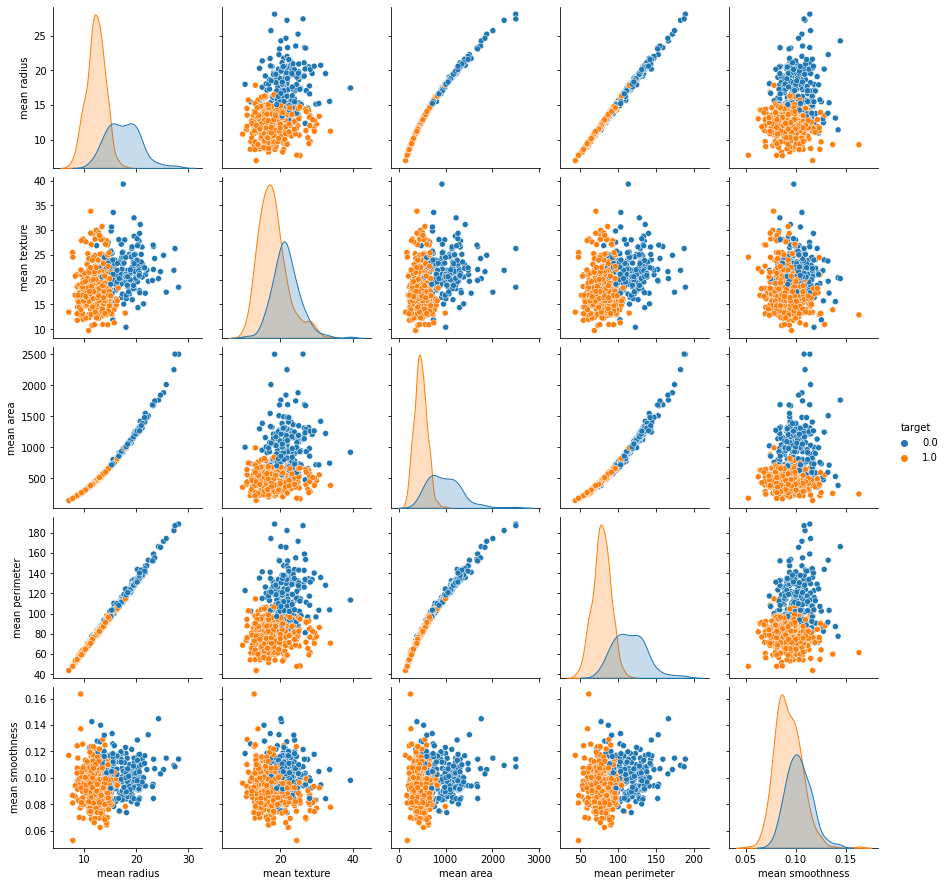
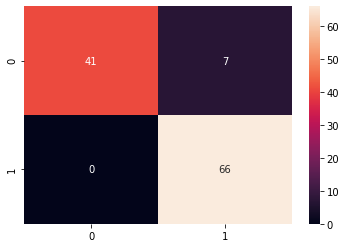

# Breast Cancer Classification
This repo consists of the Breast Cancer Classification Case Study from Super Data Science's course, Machine Learning Practical: 6 Real-World Applications.

## Problem Statement
Predicting if the cancer diagnosis is benign or malignant based on several observations/features.

## Model Used
The case study utilises Support Vector Machine (SVM) Model, with 'rbf' Kernel.

## Libraries Used
- Pandas
- Numpy
- Matplotlib
- Seaborn
- Scikit Learn

## Visualisation of the Data
*The following plot (Seaborn Pairplot), shows plots of 5 of the features, against the same 5 features, out of 30 features of the Dataset.*
 
 

## Correlation Matrix
*The following plot (Seaborn Heatmap) shows a correlation matrix of all the 30 features of the Dataset.*
 
 

## Confusion Matrix (Without Normalisation)
*The following plot (Seaborn Heatmap) shows the Confusion Matrix for the Test Set Results & the Predicted Results, without any Normalisation*
 
 

## Confusion Matrix (With Normalisation)
*The following plot (Seaborn Heatmap) shows the Confusion Matrix for the Test Set Results & the Predicted Results, with Normalisation*
 
 
